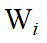
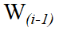
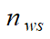
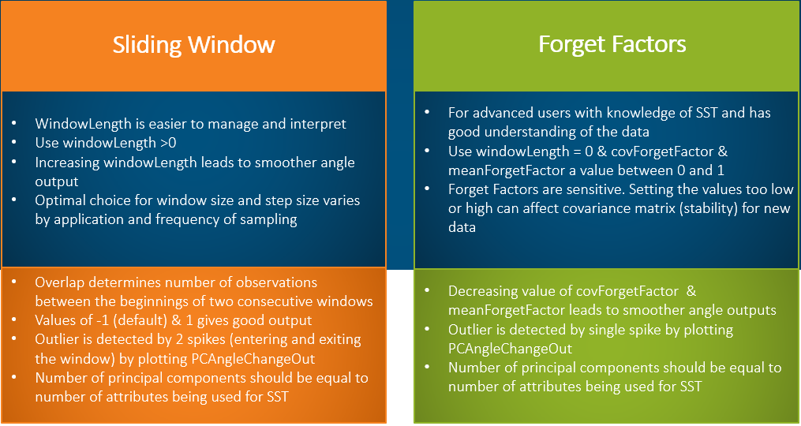
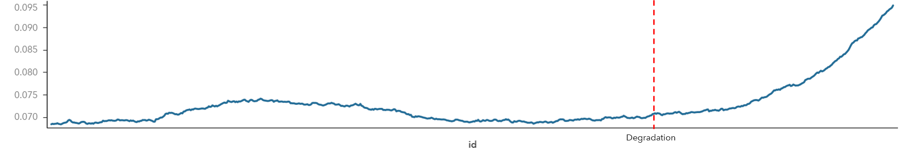
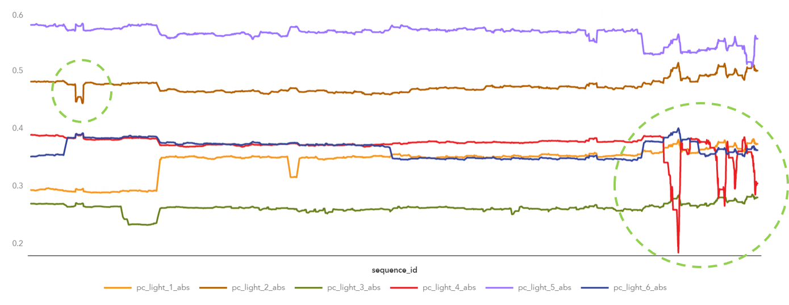
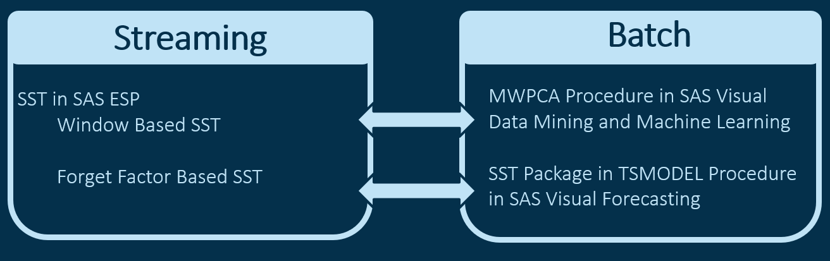

# Getting Started with Subspace Tracking

**Subspace tracking (SST)** method is used to track principal subspace over time. It can be used for anomaly detection and is frequently used in the IoT world where data is gathered from many sensors that are connected to each other and have high correlation. 
This approach converts a set of correlated variables to a set of linearly uncorrelated variables known as principal components. Because the first few principal components usually capture most of the variability in the data, they can be tracked over time to assess whether any changes have taken place in the subspace that is spanned by the data. 

We can use SST to detect outliers by tracking angle changes between principal components or by using principal component distances away from the mean.

It can be used for: 
*  **Anomaly Detection**: Large angle change between window   and  with window size  implies there’s an anomaly on observations leaving or entering the current window
*  **Degradation Detection**: Angles for a series of windows change, gradually increasing or decreasing can also detect degradation over time  

## Pre-Requisites & Best Practices
             
### Data
*  Data contains single measure for sensors from various devices operating under similar conditions. Example, energy output from multiple panels in a Solar farm.
*  Or data contains multiple measures for sensors from single device operating under similar conditions. Example, turbofan in an aircraft.
*  Enough observations indicating normal behavior 
*  Timeline is continuous
*  Explore data to check outliers, gaps in time interval, and availability of sufficient normal data

### Analytical Approach
Two different analytical approaches can be used:
*  Forget factor based SST is a fast algorithm using a power-based method. It requires two forget factors (mean and covariance). 
*  Window based SST performs principal component analysis (PCA) on sliding windows of size  and allows for gradual change in trend over time. This method can easily manage the parameter tuning for streaming data to perform streaming analytics. 

See [link](https://go.documentation.sas.com/?cdcId=espcdc&cdcVersion=6.1&docsetId=espan&docsetTarget=p0dv9t241gp1ptn13vo75aol2d1b.htm&locale=en) for more details on parameters.

### Result Interpretation
The output of SST consists of the following variables:

*  PC Angle Change shows the angle change between the first principal component vector of two consecutive subspaces. In sliding window method two spikes indicate outlier entering and exiting a window. See Figure 1 below. In forget factors method each outlier is indicated by single spike. 
*  PC Absolute Angle shows the absolute angle of the first principal component vector. It indicates outliers in one or more sensors/devices or conditions affecting all sensors/devices. See Figure 2 below. The absolute angle plot shows the subspace change over time.
*  First principal component deviating for a sensor from the first principal components that are associated with the other sensors indicates the malfunctioning sensor. See Figure 3 below.

***Figure 1: Plot of PC Angle Change over sliding windows***

*See [Anomaly detection in floodlights for Smart Campus](../README.md) for more details.*

***Figure 2: Plot of PC Absolute Angle over sliding windows*** 

*See [Detecting degradation in Wind Turbines](https://github.com/sassoftware/iot-detecting-degradation-wind-turbine) for more details.*

***Figure 3: Plot of First Principal Component over sliding windows***

*See [Anomaly detection in floodlights for Smart Campus](../README.md) for more details.*

---
**Note**: Subspace Tracking ESP plugin and corresponding batch processing mapping

SST can also be run using Proc MWPCA using [SAS Visual Data Mining and Machine Learning](https://go.documentation.sas.com/?cdcId=pgmsascdc&cdcVersion=9.4_3.4&docsetId=allprodsproc&docsetTarget=p1o1v16by0iotvn10m0jzzv9i3y8.htm&locale=en#p1wq8tbwge4vrxn1r169ruvtze1a) or with Proc TSMODEL using [SAS Visual Forecasting](https://go.documentation.sas.com/?cdcId=pgmsascdc&cdcVersion=9.4_3.4&docsetId=castsp&docsetTarget=castsp_sst_toc.htm&locale=en)
